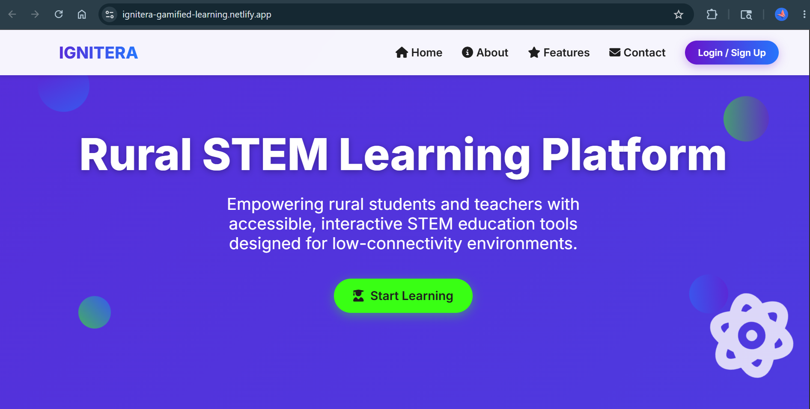
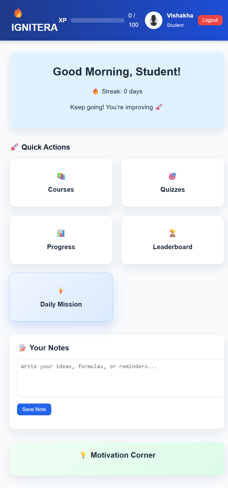

# 🚀 Ignitera — The Ultimate Learning & Gamified Dashboard

**Ignitera** is a fully interactive web-based learning platform designed for students and teachers.  
It combines education, gamification, and progress tracking to create a fun and engaging learning experience.

🌐 **Live Demo:** [Click here to view Ignitera](https://ignitera-gamified-learning.netlify.app/)

---

## 🌟 Features

✅ Student and Teacher dashboards  
✅ Gamified quizzes and challenges  
✅ Math, Physics, and STEM-based interactive games  
✅ Daily challenges and leaderboard system  
✅ Progress tracking with visual UI  
✅ Fully responsive and modern design  
✅ Built with only HTML, CSS, and JavaScript — no frameworks  

---

## 📸 Screenshots

<table>
    <tr>
        <td align="center" width="50%">
            
            <br /><strong>Home Page</strong><br />Landing view that introduces Ignitera and its core learning features.
        </td>
        <td align="center" width="50%">
            
            <br /><strong>Student Dashboard</strong><br />Student workspace for quick actions, notes, and daily motivation.
        </td>
    </tr>
    <tr>
        <td align="center" width="50%">
            
            <br /><strong>Teacher Dashboard</strong><br />Teacher view for managing courses, progress, quizzes, and class notes.
        </td>
        <td align="center" width="50%">
            
            <br /><strong>Quiz/Game Page</strong><br />Game hub with interactive learning challenges that award XP.
        </td>
    </tr>
    <tr>
        <td align="center" width="50%" colspan="2">
            
            <br /><strong>Leaderboard Page</strong><br />Competitive rankings that highlight top performers and achievements.
        </td>
    </tr>
</table>

---

## 🏗️ Folder Structure

```bash
Ignitera/
├── index.html
├── login.html
├── studentdash.html
├── teacherdashboard.html
├── course.html
├── dailychallenge.html
├── game_stem.html
├── mathgame.html
├── leaderboard.html
├── progress.html
├── phy.html
│
├── studentdash.js
├── teacherdashboard.js
├── course.js
├── dailychallenge.js
├── game_stem.js
├── mathgame.js
├── leaderboard.js
├── progress.js
├── quizz.js
│
├── studentdash.css
├── teacherdashboard.css
├── course.css
├── dailychallenge.css
├── game_stem.css
├── mathgame.css
├── leaderboard.css
├── progress.css
├── quizz.css
│
└── assets/
    ├── depositphotos_666884960-stock-illustration-default-anonymous-user-portrait-icon.jpg
    ├── screenshots/
    │   ├── home-page.png
    │   ├── student-dashboard.png
    │   ├── teacher-dashboard.png
    │   ├── quiz-game-page.png
    │   └── leaderboard-page.png
    └── other images or icons
```
## ⚙️ Technologies Used

- **HTML5** — for structure and layout.  
- **CSS3** — for modern, responsive styling.  
- **JavaScript (Vanilla)** — for interactivity and logic.  
- **Git & GitHub** — for version control and deployment.  
```
